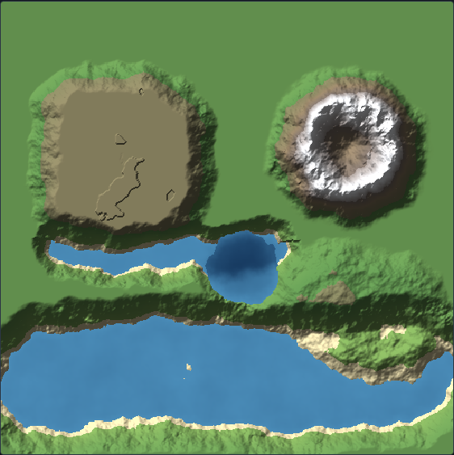

# Fractal Geology Painter

A standalone, single-file **proof-of-concept geological heightmap editor**. The user paints
*geological intent* — mountains, canyons, rivers — and procedural fractal algorithms fill the
painted mask with believable terrain. You never paint raw pixels; you paint geology.

**This project is a self-contained PoC**, developed alongside Cartalith and following the same
conventions as `urban-morphology/` (single-file HTML, headless test harness, isolated from the
main engine). Its purpose is to prototype the **stamp-based, non-destructive geology workflow**
that Cartalith's roadmap points toward.

| Artifact | File |
|---|---|
| **The app** — open in any browser via `file://`, zero dependencies, fully offline | [`Fractal Geology Painter v0.1.html`](Fractal%20Geology%20Painter%20v0.1.html) |
| Headless engine suite (noise determinism, per-feature finiteness/semantics, geometry) | `tests/run.sh` (75 assertions) |
| Browser smoke test (DOM build, pointer painting, water layer, undo, screenshot) | `tests/browser_check.js` (16 checks) |
| Showcase render | [`showcase.png`](showcase.png) |



*Above: a plateau, a volcano (cone + crater), a canyon, a lake, a coastline bay with beaches, and
rolling hills — each painted as one stroke, blended procedurally into a flat grassland base.*

## The core idea: stamps, not pixels

Following the recommendation in the brief, the editor is **stamp-based**. Every painted stroke
becomes a live procedural object on a stack:

```
Mountain Range #1  { seed, brush, params, stroke points }
River #2           { seed, brush, params, stroke points }
Canyon #3          { ... }
```

The heightmap is **rebuilt from the stack**, never edited in place. This buys, for almost no extra
complexity in a PoC:

- **Non-destructive editing** — select any past feature and re-tune its parameters; the terrain
  rebuilds around it.
- **Re-ordering** — move a canyon above/below a mountain range to change how they composite (e.g.
  erosion before vs. after rivers).
- **Cheap unlimited undo** — history is just JSON snapshots of the (lightweight) stack.
- **A clean path into Cartalith** — a stamp is exactly the kind of procedural *feature graph node*
  Cartalith's tectonic/orogeny layer already uses (`applyFeatureAlongCurve`, `buildOrogenyField`).

## Workflow

1. Pick a geological feature (or a preset).
2. Adjust global + feature-specific parameters.
3. Paint a region — a click, or a dragged stroke.
4. The generator fills the painted mask with feature-specific fractal terrain.
5. The heightmap updates immediately; the stroke joins the stack.

Select any stamp in the stack to edit it non-destructively. Toggle visibility, reorder, or delete.

## Features (11)

`Hills` · `Mountains` · `Plateau` · `Canyon` · `Valley` · `River` · `Lake` · `Basin` ·
`Coastline` · `Cliff` · `Volcano`

Each uses a different noise profile — ridged multifractal for mountains, terraced FBM for
plateaus, inverted ridged carve for canyons, radial falloff + crater for volcanoes, smooth FBM for
hills. Rivers and lakes are **semi-automatic**: they carve a bed, lower the banks, and auto-populate
a separate **water layer**. `Cliff` is the deliberate exception to smooth blending — a one-sided
escarpment (the one hard-edge tool).

## Presets (8)

`Rolling Hills` · `Alps` · `Rockies` · `Badlands` · `Volcanic Isle` · `Mesa` · `Karst` ·
`Glacial Valley` — each just seeds the tool + parameters, then you paint.

## View modes

`Terrain` (colour + hillshade) · `Heightmap` (grayscale) · `Water` · `Contours` · `Slope`, plus a
toggleable grid overlay and a live brush-size cursor. Grid assists painting only; it never
influences generation.

## Architecture (all in one file, cleanly modular)

The `<script>` is one IIFE split into labelled modules, matching the brief's "future-ready"
structure:

| Module | Role |
|---|---|
| **Noise** | Seedable Perlin (`mulberry32` permutation) + FBM / ridged / billow fractals |
| **Geometry** | Stroke distance field — signed distance (sides), arclength (meander), tangent |
| **Features** | A registry; each feature is `{ label, controls, apply(ctx,P) }`. Adding a feature = one entry |
| **Stamps** | The non-destructive stack of procedural feature objects |
| **Compositor** | Rebuilds height + water from the stack; per-stamp bounding-box (dirty-rect) locality |
| **Renderer** | Height/water → the five view modes, with hillshade + contour extraction |
| **History** | Snapshot-based undo/redo |
| **UI** | Wiring, pointer painting, presets, PNG/JSON export & import |

### Mask & blending

Painting sweeps the brush along the stroke; a pixel's **coverage** feathers with
`smoothstep((R − dist)/feather)`, where `feather = R·(1 − hardness)`. Features composite as either
`add` (displacement) or `set` (target), always weighted by coverage × intensity — so edges ramp to
the surrounding terrain and **no feature produces a cliff unless the Cliff tool is used**.

The mask footprint itself is **domain-warped by fractal noise** (the `Edge noise` slider) before
coverage is computed, so feature boundaries are ragged and organic — irregular mesa rims, wobbly
crater/lake shorelines, broken hill margins — rather than a smooth rounded brush blob. The
feature's *interior* fractal detail still samples the true coordinates, so only the boundary is
perturbed. Set `Edge noise` to 0 for perfectly smooth feathered edges.

### Performance / dirty rectangles

Generation only touches each stamp's bounding box, never the whole map. While you drag, only the
in-progress stroke is recomposited over the baked stack (one `Float32Array` copy + a bbox pass per
animation frame); the committed stack bakes in place on release. Full rebuilds happen only on
undo / reorder / parameter-tuning of an existing stamp.

## Verification

```bash
tests/run.sh                       # extract pure engine → node --check → 75-assertion suite
node tests/browser_check.js        # real headless Chromium: paint, water, views, undo + screenshot
```

The headless suite covers the pure, DOM-free engine (noise, geometry, feature generation,
compositing) delimited by `<ENGINE-START>`/`<ENGINE-END>` markers — the same extract-and-test
pattern the main Cartalith engine and the urban-morphology PoC use. The renderer, canvas
interaction, and UI are covered by the Playwright browser check.

## Status & next steps

Working PoC covering the full brief: 11 feature brushes, the stamp stack, water system, five view
modes, presets, undo/redo, and PNG/JSON project I/O. Deliberately deferred (listed in the brief as
optional/advanced): a post-placement hydraulic/thermal **erosion** pass, domain-warp on the mask,
and true incremental dirty-rect caching across the whole stack (today a stamp *edit* triggers a
full rebuild rather than recompositing only from that layer up).
